# HashiCorp Vault HA on Kubernetes

> **IPA TLS revision:** This edition uses a IPA-issued certificate whose only DNS SAN is `vault.openhelp.net`. Internal Kubernetes connections continue to use Kubernetes service names, but explicitly validate the certificate with TLS server name `vault.openhelp.net`. This avoids creating IPA identities for Kubernetes-only DNS names and keeps TLS hostname verification enabled.

> **Environment:** Kubernetes `v1.29.x`, nodes `kube2`–`kube7`, Ceph RBD StorageClass `rook-ceph-block`, MetalLB, FreeIPA CA, kube-prometheus-stack release `monitoring`, Grafana, and NGINX available for a later phase.
>
> **Purpose:** This is a production-style **lab** deployment using three Vault servers, Integrated Storage (Raft), TLS, persistent Ceph RBD volumes, a MetalLB LoadBalancer, Kubernetes authentication, Vault Agent Injector, dynamic MySQL credentials, Prometheus, and Grafana.


> **Lab storage update:** This guide has been adjusted for a constrained lab environment. All Vault data PVCs, Vault audit PVCs, and the MySQL PVC now request **512 MiB** instead of **2 GiB**. This is suitable only for learning and functional testing. For production, size the volumes based on expected secret, lease, audit-log, and database growth.

>
> **Important:** The guide uses manual Shamir unseal. A real production deployment should normally use a supported auto-unseal mechanism and a secure process for key custody.

---

## Table of Contents

1. [Target architecture](#1-target-architecture)
2. [Design decisions](#2-design-decisions)
3. [Environment variables](#3-environment-variables)
4. [Pre-installation checks](#4-pre-installation-checks)
5. [Create the namespace](#5-create-the-namespace)
6. [Issue the FreeIPA certificate](#6-issue-the-freeipa-certificate)
7. [Create Kubernetes TLS resources](#7-create-kubernetes-tls-resources)
8. [Create the Vault Helm values file](#8-create-the-vault-helm-values-file)
9. [Validate and install Vault](#9-validate-and-install-vault)
10. [Verify pods, PVCs, services, and placement](#10-verify-pods-pvcs-services-and-placement)
11. [Initialize and unseal Vault](#11-initialize-and-unseal-vault)
12. [Join and verify the Raft cluster](#12-join-and-verify-the-raft-cluster)
13. [Create the MetalLB LoadBalancer](#13-create-the-metallb-loadbalancer)
14. [Configure DNS and access the Vault UI](#14-configure-dns-and-access-the-vault-ui)
15. [Enable the audit device](#15-enable-the-audit-device)
16. [Configure Kubernetes authentication](#16-configure-kubernetes-authentication)
17. [KV secret injection test](#17-kv-secret-injection-test)
18. [Deploy MySQL](#18-deploy-mysql)
19. [Create MySQL data and the Vault administration user](#19-create-mysql-data-and-the-vault-administration-user)
20. [Configure dynamic MySQL credentials](#20-configure-dynamic-mysql-credentials)
21. [Inject dynamic MySQL credentials into a pod](#21-inject-dynamic-mysql-credentials-into-a-pod)
22. [Test credential expiry and revocation](#22-test-credential-expiry-and-revocation)
23. [Prometheus and Grafana integration](#23-prometheus-and-grafana-integration)
24. [Raft snapshot backup](#24-raft-snapshot-backup)
25. [Leader failover test](#25-leader-failover-test)
26. [Troubleshooting](#26-troubleshooting)
27. [Production recommendations](#27-production-recommendations)
28. [Uninstall and cleanup](#28-uninstall-and-cleanup)
29. [Interview questions and answers](#29-interview-questions-and-answers)

---

# 1. Target Architecture

HashiCorp Vault is a centralized secrets management and identity-based access solution used to securely store, control, and protect sensitive information such as passwords, API keys, database credentials, certificates, and encryption keys. Instead of hardcoding secrets in applications or configuration files, applications authenticate to Vault and receive only the secrets they are authorized to access. Vault also supports dynamic secrets, automatic credential rotation, encryption as a service, detailed audit logging, and short-lived access tokens, making it much more secure than storing static secrets in source code or configuration files. It is widely used in cloud, Kubernetes, and enterprise environments to improve security, simplify secret management, and reduce the risk of credential leakage.


1. Administrator Opens vault.openhelp.net

The administrator accesses Vault through the UI, CLI, or API.
Vault is used to manage secrets, policies, authentication methods, tokens, and database roles.

2. MetalLB Receives the Traffic

MetalLB provides the external IP address for vault.openhelp.net.
It forwards the incoming traffic from outside the cluster to the Vault Kubernetes service.

3. vault-active-lb Selects the Active Vault Leader

The vault-active-lb Kubernetes Service sends traffic only to the active Vault pod.
The remaining Vault pods stay in standby mode and are ready for failover.

4. The Active Vault Pod Processes the Request

The active Vault leader validates the client token and attached policies.
It then performs operations such as login, secret retrieval, token creation, or database credential generation.

5. Vault Data Is Replicated Through Raft

The active Vault leader replicates data to the standby Vault members using Raft.
This includes policies, authentication configuration, tokens, leases, secret metadata, and Vault configuration.

6. Vault Data and Audit Logs Are Stored on Ceph PVCs

Each Vault pod uses a Ceph RBD PVC to store its persistent Raft data.
Separate audit PVCs store login events, secret access, policy changes, token creation, and other security activities.

7. Vault Agent Injector Modifies the Application Pod

The Vault Agent Injector detects Vault annotations in the application Pod definition.
It adds a Vault Agent container, shared volume, authentication configuration, and secret templates before the Pod starts.

8. Vault Agent Authenticates Using a ServiceAccount JWT

Kubernetes provides the application Pod with a ServiceAccount JWT.
The Vault Agent sends this JWT to Vault, which validates the ServiceAccount, namespace, token audience, and expiry.

9. Vault Agent Retrieves and Injects the Authorised Secret

Vault checks the policy attached to the application's Vault role.
When access is allowed, the Vault Agent writes the secret into a shared file such as /vault/secrets/config.

10. The Application Connects to MySQL and Monitoring Collects Metrics

The application uses the injected static or dynamic credentials to connect to MySQL.
MySQL stores its data on a Ceph PVC, while Prometheus collects Vault metrics and Grafana displays health, leader status, authentication failures, and performance.


---

# 2. Design Decisions

| Area | Selected Design | Reason |
|---|---|---|
| Vault mode | HA | Three nodes permit one-node failure while retaining quorum |
| Storage engine | Integrated Storage (Raft) | Vault’s built-in HA storage and recommended default for new deployments |
| Physical storage | Ceph RBD | Each Raft member needs its own durable `ReadWriteOnce` filesystem |
| Vault data PVC | 512 MiB per pod | Suitable for this lab; monitor usage before production |
| Audit PVC | 512 MiB per pod | Keeps audit data separate from Raft data |
| External access | MetalLB LoadBalancer | Direct lab access without depending on Ingress initially |
| External hostname | `vault.openhelp.net` | Stable TLS and client endpoint |
| TLS authority | FreeIPA CA | Matches the existing internal PKI |
| Secret consumption | Vault Agent Injector | Applications consume rendered files without embedding Vault logic |
| Database credentials | Dynamic MySQL role | Short-lived credentials are created and revoked automatically |
| Monitoring | Prometheus Operator + Grafana | Matches the existing `monitoring` stack |
| Unseal | Shamir manual unseal | Useful for learning; auto-unseal is recommended for real production |

## Why Raft still uses Ceph RBD

Raft is Vault’s **logical storage engine**. Ceph RBD is the persistent disk underneath it.


The Vault Pod writes its Raft data to a directory such as /vault/data, and that directory is mounted on a Kubernetes PVC so the data stays persistent even if the pod restarts.

That PVC is backed by a Ceph RBD image, which acts like a virtual block disk provided by the Ceph storage cluster.

The Ceph RBD image stores its actual blocks on Ceph OSDs, which are the storage daemons running across the Ceph nodes.

So in simple terms, Vault manages the logical data, the PVC gives Kubernetes persistent storage, Ceph RBD provides the disk, and Ceph OSDs physically store and replicate the data for durability.

---

# 3. Environment Variables

Run these commands on the administration host, such as `kube2`.

Choose an unused IP from the MetalLB address pool. `192.168.0.248` is only an example.

```bash
export VAULT_NAMESPACE="vault"
export VAULT_RELEASE="vault"
export VAULT_HOST="vault.openhelp.net"
export VAULT_LB_IP="192.168.0.240"
export VAULT_STORAGE_CLASS="rook-ceph-block"
export VAULT_CHART_VERSION="0.33.0"
```

Check that the proposed LoadBalancer IP is unused:

```bash
ping -c 2 "${VAULT_LB_IP}"
arping -D -I <LAN_INTERFACE> "${VAULT_LB_IP}" -c 3
```

Expected: no existing host should answer for the selected address.

> Replace `<LAN_INTERFACE>` with the interface connected to `192.168.0.0/24`, for example `ens18` or `eth0`.

---

# 4. Pre-installation Checks

## 4.1 Check Kubernetes

```bash
kubectl version
kubectl get nodes -o wide
```

Expected nodes:

```text
kube2.openhelp.net
kube3.openhelp.net
kube4.openhelp.net
kube5.openhelp.net
kube6.openhelp.net
kube7.openhelp.net
```

## 4.2 Check Helm

```bash
helm version
```

Use Helm 3.6 or newer.

## 4.3 Verify Ceph RBD

```bash
kubectl get storageclass
kubectl get storageclass "${VAULT_STORAGE_CLASS}" -o yaml
```

Confirm:

```text
provisioner: rook-ceph.rbd.csi.ceph.com
allowVolumeExpansion: true
```

## 4.4 Verify MetalLB

```bash
kubectl get pods -A | grep -i metallb
kubectl get ipaddresspools -A
kubectl get l2advertisements -A
```

Make sure `${VAULT_LB_IP}` belongs to an advertised pool.

## 4.5 Verify Prometheus Operator

```bash
kubectl get crd servicemonitors.monitoring.coreos.com
helm list -n monitoring
```

Expected Helm release:

```text
monitoring
```

## 4.6 Check DNS

```bash
getent hosts ipa.openhelp.net
```

The FreeIPA host should resolve.

---

# 5. Create the Namespace

```bash
kubectl create namespace "${VAULT_NAMESPACE}"
kubectl label namespace "${VAULT_NAMESPACE}" app.kubernetes.io/part-of=vault
```

Verify:

```bash
kubectl get namespace "${VAULT_NAMESPACE}" --show-labels
```

---

# 6. Issue the FreeIPA Certificate

The FreeIPA certificate is issued for the stable external name `vault.openhelp.net`.

Vault still connects internally through Kubernetes service names such as `vault-0.vault-internal`, but those clients explicitly set the TLS server name to `vault.openhelp.net`. This allows one FreeIPA certificate to be used without disabling hostname verification.

## 6.1 Required DNS names

> **Important (FreeIPA fix):** When using FreeIPA as the certificate authority, issue the certificate **only** for the external hostname. Do **not** include Kubernetes internal names (`vault`, `vault.vault.svc`, `vault-internal`, `vault-0...`) because FreeIPA validates every DNS SAN against IPA identities and the certificate request will fail.

Use the following Subject Alternative Name:

```text
vault.openhelp.net
```

## 6.2 Create the external DNS and service principal

Run these commands on the FreeIPA server as an IPA administrator:

```bash
kinit admin

ipa dnsrecord-add openhelp.net vault \
  --a-rec="${VAULT_LB_IP}"

ipa service-add "HTTP/${VAULT_HOST}"
```

If the DNS record or service already exists, verify it instead:

```bash
ipa dnsrecord-show openhelp.net vault
ipa service-show "HTTP/${VAULT_HOST}"
```

Expected values:

```text
Record name: vault
A record: 192.168.0.248
Principal name: HTTP/vault.openhelp.net@OPENHELP.NET
```


## 6.3 Create the private key and CSR

Run on a secure administration host:

```bash
mkdir -p ~/vault-tls
cd ~/vault-tls

openssl genrsa -out vault.key 4096
chmod 600 vault.key
```

Create `vault-openssl.cnf`:

```bash
cat > vault-openssl.cnf <<'EOF'
[ req ]
default_bits       = 4096
prompt             = no
default_md         = sha256
distinguished_name = dn
req_extensions     = req_ext

[ dn ]
CN = vault.openhelp.net
O  = OPENHELP.NET

[ req_ext ]
subjectAltName = @alt_names
keyUsage = critical, digitalSignature, keyEncipherment
extendedKeyUsage = serverAuth

[ alt_names ]
DNS.1 = vault.openhelp.net
EOF
```

Generate the CSR:

```bash
openssl req \
  -new \
  -key vault.key \
  -out vault.csr \
  -config vault-openssl.cnf
```

Verify:

```bash
openssl req -in vault.csr -noout -text | sed -n '/Subject Alternative Name/,+4p'
```

Expected SAN:

```text
DNS:vault.openhelp.net
```

## 6.4 Sign the CSR with FreeIPA

Copy the CSR to the FreeIPA server or run the following from an enrolled IPA client:

```bash
kinit admin

ipa cert-request vault.csr \
  --principal="HTTP/${VAULT_HOST}" \
  --certificate-out=vault.crt
```

> **FreeIPA fix:** The CSR must contain only `DNS:vault.openhelp.net`. The default FreeIPA service-certificate workflow validates DNS SAN identities, so Kubernetes-only names must not be included in this CSR.

Export the FreeIPA CA certificate:

```bash
cp /etc/ipa/ca.crt ./freeipa-ca.crt
```

Verify the resulting certificate:

```bash
openssl x509 -in vault.crt -noout -subject -issuer -dates
openssl x509 -in vault.crt -noout -text | sed -n '/Subject Alternative Name/,+4p'
openssl verify -CAfile freeipa-ca.crt vault.crt
```

Expected:

```text
vault.crt: OK
```

---

# 7. Create Kubernetes TLS Resources

From the directory containing `vault.key`, `vault.crt`, and `freeipa-ca.crt`:

```bash
kubectl -n "${VAULT_NAMESPACE}" create secret generic vault-server-tls \
  --from-file=tls.key=vault.key \
  --from-file=tls.crt=vault.crt \
  --from-file=ca.crt=freeipa-ca.crt
```

Create a CA-only ConfigMap:

```bash
kubectl -n "${VAULT_NAMESPACE}" create configmap vault-ca \
  --from-file=ca.crt=freeipa-ca.crt
```

Verify keys without exposing private data:

```bash
kubectl -n "${VAULT_NAMESPACE}" describe secret vault-server-tls
kubectl -n "${VAULT_NAMESPACE}" describe configmap vault-ca

kubectl -n "${VAULT_NAMESPACE}" get secret vault-server-tls \
  -o jsonpath='{.data.tls\.crt}' | base64 -d | \
  openssl x509 -noout -subject -issuer -ext subjectAltName
```

Expected secret keys:

```text
ca.crt
tls.crt
tls.key
```

---

# 8. Create the Vault Helm Values File

Create `vault-values.yaml`:

```bash
cat > vault-values.yaml <<'EOF'
global:
  enabled: true
  tlsDisable: false

injector:
  enabled: true
  replicas: 2

  resources:
    requests:
      cpu: 100m
      memory: 128Mi
    limits:
      cpu: 500m
      memory: 256Mi

  webhook:
    failurePolicy: Ignore

server:
  enabled: true

  image:
    repository: hashicorp/vault
    tag: "2.0.3"
    pullPolicy: IfNotPresent

  updateStrategyType: "OnDelete"

  logLevel: "info"
  logFormat: "json"

  resources:
    requests:
      cpu: 250m
      memory: 512Mi
    limits:
      cpu: "1"
      memory: 1Gi

  extraEnvironmentVars:
    VAULT_CACERT: /vault/tls/ca.crt
    VAULT_TLS_SERVER_NAME: vault.openhelp.net

  volumes:
    - name: vault-server-tls
      secret:
        secretName: vault-server-tls
        defaultMode: 0440

  volumeMounts:
    - name: vault-server-tls
      mountPath: /vault/tls
      readOnly: true

  dataStorage:
    enabled: true
    size: 512Mi
    mountPath: /vault/data
    storageClass: rook-ceph-block
    accessMode: ReadWriteOnce
    persistentVolumeClaimRetentionPolicy:
      whenDeleted: Retain
      whenScaled: Retain

  auditStorage:
    enabled: true
    size: 512Mi
    mountPath: /vault/audit
    storageClass: rook-ceph-block
    accessMode: ReadWriteOnce

  service:
    enabled: true
    type: ClusterIP
    port: 8200
    targetPort: 8200
    publishNotReadyAddresses: true
    active:
      enabled: true
    standby:
      enabled: true

  authDelegator:
    enabled: true

  standalone:
    enabled: false

  ha:
    enabled: true
    replicas: 3

    raft:
      enabled: true
      setNodeId: true

      config: |
        ui = true
        disable_mlock = true

        listener "tcp" {
          address            = "[::]:8200"
          cluster_address    = "[::]:8201"
          tls_disable        = 0
          tls_cert_file      = "/vault/tls/tls.crt"
          tls_key_file       = "/vault/tls/tls.key"
          tls_client_ca_file = "/vault/tls/ca.crt"

          telemetry {
            unauthenticated_metrics_access = "true"
          }
        }

        storage "raft" {
          path    = "/vault/data"
          node_id = "HOSTNAME"

          retry_join {
            leader_api_addr         = "https://vault-0.vault-internal:8200"
            leader_ca_cert_file     = "/vault/tls/ca.crt"
            leader_client_cert_file = "/vault/tls/tls.crt"
            leader_client_key_file  = "/vault/tls/tls.key"
            leader_tls_servername   = "vault.openhelp.net"
          }

          retry_join {
            leader_api_addr         = "https://vault-1.vault-internal:8200"
            leader_ca_cert_file     = "/vault/tls/ca.crt"
            leader_client_cert_file = "/vault/tls/tls.crt"
            leader_client_key_file  = "/vault/tls/tls.key"
            leader_tls_servername   = "vault.openhelp.net"
          }

          retry_join {
            leader_api_addr         = "https://vault-2.vault-internal:8200"
            leader_ca_cert_file     = "/vault/tls/ca.crt"
            leader_client_cert_file = "/vault/tls/tls.crt"
            leader_client_key_file  = "/vault/tls/tls.key"
            leader_tls_servername   = "vault.openhelp.net"
          }
        }

        service_registration "kubernetes" {}

        telemetry {
          prometheus_retention_time = "30s"
          disable_hostname          = true
        }

  affinity: |
    podAntiAffinity:
      requiredDuringSchedulingIgnoredDuringExecution:
        - labelSelector:
            matchLabels:
              app.kubernetes.io/name: vault
              app.kubernetes.io/instance: vault
              component: server
          topologyKey: kubernetes.io/hostname

  disruptionBudget:
    enabled: true
    maxUnavailable: 1

ui:
  enabled: true
  serviceType: ClusterIP
  externalPort: 8200

csi:
  enabled: false
EOF
```

## 8.1 Explanation of important fields

| Field | Purpose |
|---|---|
| `global.tlsDisable: false` | Tells chart components to use TLS |
| `injector.enabled` | Installs the mutating admission webhook |
| `injector.replicas: 2` | Avoids a single injector pod |
| `webhook.failurePolicy: Ignore` | Prevents a webhook outage from blocking all pod creation in the lab |
| `server.image.tag` | Pins the Vault image instead of silently changing versions |
| `updateStrategyType: OnDelete` | Prevents uncontrolled rolling updates of Vault StatefulSet pods |
| `VAULT_CACERT` | Makes the Vault CLI trust the FreeIPA CA |
| `VAULT_TLS_SERVER_NAME` | Makes Vault CLI connections inside pods validate the certificate as `vault.openhelp.net`, including connections to `127.0.0.1` or Kubernetes service names |
| `volumes` / `volumeMounts` | Mounts the certificate, key, and CA |
| `dataStorage.size: 512Mi` | Creates one 512 MiB RBD PVC per Vault pod (lab size) |
| `auditStorage.size: 512Mi` | Creates one 512 MiB RBD PVC per Vault pod (lab size) for audit logs |
| `persistentVolumeClaimRetentionPolicy` | Retains Raft PVCs if the StatefulSet is deleted or scaled |
| `ha.enabled` | Enables the HA StatefulSet |
| `ha.replicas: 3` | Creates three Vault server pods |
| `raft.enabled` | Uses Integrated Storage |
| `setNodeId: true` | Uses pod names as Raft node IDs |
| `disable_mlock = true` | Recommended for Raft’s memory-mapped storage behavior |
| `listener "tcp"` | Enables HTTPS API port 8200 and cluster port 8201 |
| `storage "raft"` | Stores Vault data under `/vault/data` |
| `retry_join` | Allows members to discover and join an initialized Raft cluster |
| `leader_tls_servername` | Validates the FreeIPA certificate as `vault.openhelp.net` while connecting to internal Raft service names |
| `service_registration "kubernetes"` | Labels active/standby pods so services can select the leader |
| `telemetry` | Exposes Prometheus-format metrics |
| `podAntiAffinity` | Places Vault servers on separate Kubernetes nodes |
| `maxUnavailable: 1` | Protects quorum during voluntary disruptions |
| `ui.enabled` | Enables the Vault web UI |

> The chart creates six PVCs because both `dataStorage` and `auditStorage` are enabled: three Raft PVCs and three audit PVCs.

---

# 9. Validate and Install Vault

## 9.1 Add the official Helm repository

```bash
helm repo add hashicorp https://helm.releases.hashicorp.com
helm repo update
```

Check available chart versions:

```bash
helm search repo hashicorp/vault --versions | head
```

## 9.2 Render before installation

```bash
helm template "${VAULT_RELEASE}" hashicorp/vault \
  --namespace "${VAULT_NAMESPACE}" \
  --version "${VAULT_CHART_VERSION}" \
  -f vault-values.yaml \
  > vault-rendered.yaml
```

Check for obvious errors:

```bash
grep -n "kind: StatefulSet" vault-rendered.yaml
grep -n "rook-ceph-block" vault-rendered.yaml
grep -n "vault-server-tls" vault-rendered.yaml
grep -n "VAULT_TLS_SERVER_NAME" vault-rendered.yaml
grep -n "leader_tls_servername" vault-rendered.yaml
```

Run Helm dry-run:

```bash
helm install "${VAULT_RELEASE}" hashicorp/vault \
  --namespace "${VAULT_NAMESPACE}" \
  --version "${VAULT_CHART_VERSION}" \
  -f vault-values.yaml \
  --dry-run
```

## 9.3 Install

```bash
helm install "${VAULT_RELEASE}" hashicorp/vault \
  --namespace "${VAULT_NAMESPACE}" \
  --version "${VAULT_CHART_VERSION}" \
  -f vault-values.yaml
```

Expected Helm output includes:

```text
NAME: vault
NAMESPACE: vault
STATUS: deployed
```

> Vault server pods may show `0/1 Running` until initialization and unseal. That is expected.

---

# 10. Verify Pods, PVCs, Services, and Placement

## 10.1 Pods

```bash
kubectl get pods -n vault -o wide
```

Expected:

```text
vault-0                         0/1   Running
vault-1                         0/1   Running
vault-2                         0/1   Running
vault-agent-injector-...        1/1   Running
vault-agent-injector-...        1/1   Running
```

The three server pods should be on three different nodes.

## 10.2 PVCs

```bash
kubectl get pvc -n vault
```

Expected names similar to:

```text
data-vault-0
data-vault-1
data-vault-2
audit-vault-0
audit-vault-1
audit-vault-2
```

Each should show:

```text
STATUS: Bound
CAPACITY: 512Mi
STORAGECLASS: rook-ceph-block
```

## 10.3 Services

```bash
kubectl get svc -n vault
```

Expected services include:

```text
vault
vault-active
vault-internal
vault-standby
vault-ui
vault-agent-injector-svc
```

## 10.4 Logs

```bash
kubectl logs -n vault vault-0 --tail=100
```

Before initialization, messages indicating that Vault is sealed or uninitialized are normal.

---

# 11. Initialize and Unseal Vault
Check the status of vault-0:
```bash
kubectl exec -n vault vault-0 -- vault status
```


## 11.1 Initialize exactly once

Run initialization only against `vault-0`.

```bash
kubectl exec -n vault vault-0 -- \
  vault operator init \
  -key-shares=5 \
  -key-threshold=3 \
  -format=json > vault-init.json
```

Protect the file:

```bash
chmod 600 vault-init.json
```

Verify that initialization succeeded:

```bash
jq '{
  unseal_keys: (.unseal_keys_b64 | length),
  root_token_present: (.root_token | length > 0)
}' vault-init.json
```

Expected:

```json
{
  "unseal_key_count": 5,
  "has_root_token": true
}
```

## 11.2 Operational security

For a real deployment:

- Never keep all unseal shares on one host.
- Give shares to different trusted custodians.
- Do not place `vault-init.json` in Git, email, Slack, Kubernetes Secrets, or a shared filesystem.
- Revoke routine use of the initial root token after creating administrative identities and policies.
- Keep an offline, tested recovery procedure.

## 11.3 Unseal `vault-0`

```bash
root@kube2:~# cd vault-tls/

root@kube2:~#for KEY_INDEX in 0 1 2; do
  KEY=$(jq -r ".unseal_keys_b64[${KEY_INDEX}]" vault-init.json)
  kubectl exec -n vault vault-0 -- vault operator unseal "${KEY}"
done
```

## View all unseal keys

Run:
```bash
jq -r '.unseal_keys_b64[]' vault-init.json
```

Check:

```bash
kubectl exec -n vault vault-0 -- vault status
```

Expected:

```text
Initialized    true
Sealed         false
HA Enabled     true
HA Mode        active
```

## 11.4 Unseal `vault-1` and `vault-2`

```bash
for POD in vault-1 vault-2; do
  for KEY_INDEX in 0 1 2; do
    KEY=$(jq -r ".unseal_keys_b64[${KEY_INDEX}]" vault-init.json)

    kubectl exec -n vault "${POD}" -- \
      vault operator unseal "${KEY}"
  done
done
```

Verify all members:

```bash
for POD in vault-0 vault-1 vault-2; do
  echo "===== ${POD} ====="

  kubectl exec -n vault "${POD}" -- \
    vault status || true
done
```

Expected 

```bash
vault-0
Initialized    true
Sealed         false
HA Mode        active
```

and for the other two:
```bash
Initialized    true
Sealed         false
HA Mode        standby
```

Then check the pods again:
```bash
root@kube2:~/vault-tls# kubectl get pods -n vault -o wide
NAME                                    READY   STATUS    RESTARTS   AGE   IP               NODE                 NOMINATED NODE   READINESS GATES
vault-0                                 1/1     Running   0          79m   10.244.247.238   kube7.openhelp.net   <none>           <none>
vault-1                                 1/1     Running   0          79m   10.244.233.132   kube6.openhelp.net   <none>           <none>
vault-2                                 1/1     Running   0          79m   10.244.163.11    kube5.openhelp.net   <none>           <none>
vault-agent-injector-7bd4699b6c-lhxvz   1/1     Running   0          79m   10.244.233.139   kube6.openhelp.net   <none>           <none>
vault-agent-injector-7bd4699b6c-wpfn7   1/1     Running   0          79m   10.244.247.235   kube7.openhelp.net   <none>           <none>

```

---

# 12. Join and Verify the Raft Cluster

The `retry_join` configuration should join the members automatically after they are unsealed.

## 12.1 Login in `vault-0`

```bash
export VAULT_ROOT_TOKEN=$(jq -r '.root_token' vault-init.json)

kubectl exec -n vault vault-0 -- \
  sh -c "VAULT_TOKEN='${VAULT_ROOT_TOKEN}' vault operator raft list-peers"
```

Expected:

```text
Node       Address                                      State       Voter
vault-0    vault-0.vault-internal.vault.svc:8201        leader      true
vault-1    vault-1.vault-internal.vault.svc:8201        follower    true
vault-2    vault-2.vault-internal.vault.svc:8201        follower    true
```

Also verify the Raft cluster:

```text
export VAULT_ROOT_TOKEN=$(jq -r '.root_token' vault-init.json)
kubectl exec -n vault vault-0 -- \
  sh -c "VAULT_TOKEN='${VAULT_ROOT_TOKEN}' vault operator raft list-peers"
```

Expected output 

```text

Node       Address                        State       Voter
----       -------                        -----       -----
vault-0    vault-0.vault-internal:8201    leader      true
vault-1    vault-1.vault-internal:8201    follower    true
vault-2    vault-2.vault-internal:8201    follower    true

```

---

# 13. Add the NGINX Ingress Helm repository

```text
helm repo add ingress-nginx https://kubernetes.github.io/ingress-nginx
helm repo update
```

Verify the repository:

```text
helm search repo ingress-nginx/ingress-nginx
```

# Create the NGINX Ingress values file

The IP 192.168.0.240 must be available in your MetalLB IP pool.

```text
cat > ingress-nginx-values.yaml <<'EOF'
controller:
  replicaCount: 2

  ingressClassResource:
    name: nginx
    enabled: true
    default: true

  ingressClass: nginx

  service:
    type: LoadBalancer
    externalTrafficPolicy: Cluster

    annotations:
      metallb.universe.tf/loadBalancerIPs: "192.168.0.240"

  config:
    use-forwarded-headers: "true"
    enable-real-ip: "true"
    proxy-buffering: "off"
    proxy-request-buffering: "off"

  metrics:
    enabled: true

  admissionWebhooks:
    enabled: true
EOF
```

Review the file:

cat ingress-nginx-values.yaml


# Install the NGINX Ingress Controller

```text
helm upgrade --install ingress-nginx ingress-nginx/ingress-nginx \
  --namespace ingress-nginx \
  --create-namespace \
  -f ingress-nginx-values.yaml
```

Wait for the controller to become ready:

```text
kubectl rollout status deployment/ingress-nginx-controller \
  -n ingress-nginx \
  --timeout=300s
```
# Verify the Ingress Controller

Check pods:
```text
kubectl get pods -n ingress-nginx -o wide
```

Expected: two controller pods should be running.
```text
ingress-nginx-controller-xxxxx   1/1   Running
ingress-nginx-controller-yyyyy   1/1   Running
```

Check the LoadBalancer service:
```text
kubectl get svc -n ingress-nginx -o wide
```

Expected:
```text
ingress-nginx-controller   LoadBalancer   ...   192.168.0.240   80:xxxxx/TCP,443:xxxxx/TCP
```


Check the IngressClass:
```text
kubectl get ingressclass
```

Expected:
```text
NAME    CONTROLLER                     PARAMETERS   AGE
nginx   k8s.io/ingress-nginx           <none>       ...
```

5. Verify Vault services

```text
kubectl get svc -n vault
```
You should see services such as:

```text
vault
vault-active
vault-internal
vault-standby
vault-ui
```
The Ingress will forward traffic to:

vault-active:8200

Check its endpoint:

```text
kubectl get endpoints -n vault vault-active -o wide
```
It should contain the IP of the current active Vault pod.

6. Verify Vault cluster status

```text
for POD in vault-0 vault-1 vault-2; do
  echo "===== ${POD} ====="
  kubectl exec -n vault "${POD}" -- vault status || true
done
```

Expected:
```text
One Vault pod should show HA Mode: active.
Two Vault pods should show HA Mode: standby.
All pods should show Sealed: false.
```


Example:
```text
===== vault-0 =====
Initialized     true
Sealed          false
HA Enabled      true
HA Mode         active

Standby nodes:

Initialized     true
Sealed          false
HA Enabled      true
HA Mode         standby
```
Also verify pod readiness:

```text
kubectl get pods -n vault -o wide
```

7. Create the TLS secret for the Ingress

Change to the directory containing the certificate and key:
```text
cd ~/vault-tls
ls -l vault.crt vault.key
```
Create the Kubernetes TLS secret:

```text
kubectl create secret tls vault-ingress-tls \
  --namespace vault \
  --cert=vault.crt \
  --key=vault.key \
  --dry-run=client -o yaml | kubectl apply -f -
```

This command safely creates the secret if it does not exist or updates it if it already exists.

Verify the secret:

```text
kubectl get secret vault-ingress-tls -n vault
```
Expected type:

```text
NAME                TYPE                DATA   AGE
vault-ingress-tls   kubernetes.io/tls   2      ...
```

8. Verify the certificate stored in the secret

```text
kubectl get secret vault-ingress-tls \
  -n vault \
  -o jsonpath='{.data.tls\.crt}' |
base64 -d |
openssl x509 \
  -noout \
  -subject \
  -issuer \
  -dates \
  -ext subjectAltName
```

Expected certificate details should include:

```text
subject=O = OPENHELP.NET, CN = vault.openhelp.net
issuer=O = OPENHELP.NET, CN = Certificate Authority
DNS:vault.openhelp.net
```

The certificate must contain:

DNS:vault.openhelp.net


9. Create the Vault Ingress manifest

```text
cat > vault-ingress.yaml <<'EOF'
apiVersion: networking.k8s.io/v1
kind: Ingress
metadata:
  name: vault-ingress
  namespace: vault
  annotations:
    nginx.ingress.kubernetes.io/backend-protocol: "HTTPS"
    nginx.ingress.kubernetes.io/ssl-redirect: "true"
    nginx.ingress.kubernetes.io/force-ssl-redirect: "true"
spec:
  ingressClassName: nginx

  tls:
    - hosts:
        - vault.openhelp.net
      secretName: vault-ingress-tls

  rules:
    - host: vault.openhelp.net
      http:
        paths:
          - path: /
            pathType: Prefix
            backend:
              service:
                name: vault-active
                port:
                  number: 8200
EOF
```


Review:

cat vault-ingress.yaml

Important settings:

nginx.ingress.kubernetes.io/backend-protocol: "HTTPS"

This tells NGINX that Vault itself uses HTTPS on port 8200.

secretName: vault-ingress-tls

This certificate is presented to the browser.

service:
  name: vault-active
  port:
    number: 8200


This sends traffic only to the current active Vault server.


1. Verify the Vault Ingress

```text
kubectl get ingress -n vault
```
Expected:

```text
NAME            CLASS   HOSTS                  ADDRESS         PORTS
vault-ingress   nginx   vault.openhelp.net     192.168.0.240   80,443
```
Describe it:

```text
kubectl describe ingress vault-ingress -n vault
```
Check the backend:

vault-active:8200

Check the TLS configuration:

vault.openhelp.net terminates vault-ingress-tls

12. Update DNS

vault.openhelp.net must point to the NGINX Ingress LoadBalancer IP: 192.168.0.240


# 14. Configure DNS and Access the Vault UI

## 14.1 Verify FreeIPA DNS

```bash
dig +short "${VAULT_HOST}"
```

Expected:

```text
192.168.0.240
```

## 14.2 Test the API


```bash
curl --cacert /etc/ipa/ca.crt \
  "https://${VAULT_HOST}:8200/v1/sys/health"
```

Typical active-node response:

```json
{
  "initialized": true,
  "sealed": false,
  "standby": false
}
```

## 14.4 Open the UI

```text
https://vault.openhelp.net
```

Select **Token** and use the initial root token for the first administrative login.


root token you can find from the file we created earlier:-

```text
root@kube2:~/vault-tls# jq -r '.root_token' vault-init.json
hvs.earO7wnbCdy7B0Pt8F4pUzlI
```

---

# 15. Enable the Audit Device

The Helm chart only mounts the audit volume. Vault must still be told to write audit events to it.

```bash
root@kube2:~/vault-tls# VAULT_ROOT_TOKEN=hvs.earO7wnbCdy7B0Pt8F4pUzlI

root@kube2:~/vault-tls# kubectl exec -n vault vault-0 -- \
  sh -c "VAULT_TOKEN='${VAULT_ROOT_TOKEN}' \
  vault audit enable file file_path=/vault/audit/audit.log"
```

Verify:

```bash
kubectl exec -n vault vault-0 -- \
  sh -c "VAULT_TOKEN='${VAULT_ROOT_TOKEN}' vault audit list"
```

Expected:

```text
file/    file
```

Check the log:

```bash
kubectl exec -n vault vault-0 -- \
  sh -c 'ls -lh /vault/audit && tail -n 2 /vault/audit/audit.log'
```

> Audit logs contain sensitive metadata and HMAC-protected values. Restrict access and monitor disk usage.

---

# 16. Configure Kubernetes Authentication

## 16.1 Enable the authentication method

```bash
kubectl exec -n vault vault-0 -- \
  sh -c "VAULT_TOKEN='${VAULT_ROOT_TOKEN}' vault auth enable kubernetes"
```

## 16.2 Configure the Kubernetes API endpoint

Because Vault runs inside this Kubernetes cluster, it can use its pod service account token and the mounted Kubernetes CA.

```bash
kubectl exec -n vault vault-0 -- sh -c "
  VAULT_TOKEN='${VAULT_ROOT_TOKEN}' \
  vault write auth/kubernetes/config \
    kubernetes_host='https://kubernetes.default.svc:443' \
    kubernetes_ca_cert=@/var/run/secrets/kubernetes.io/serviceaccount/ca.crt
"
```

Verify:

```bash
kubectl exec -n vault vault-0 -- \
  sh -c "VAULT_TOKEN='${VAULT_ROOT_TOKEN}' vault read auth/kubernetes/config"
```

## 16.3 Create the demo namespace and service account

```bash
kubectl create namespace vault-demo

kubectl -n vault-demo create serviceaccount vault-demo
```

---

# 17.  Vault KV Secret Injection Lab


This lab verifies **Kubernetes Authentication** and the **Vault Agent Injector** before adding MySQL.

---

## Step 1 — Open Vault UI

Open

```
https://vault.openhelp.net
```

Login using your Vault credentials.

---

## Navigate

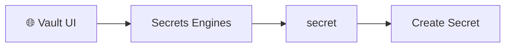

---

## Step 2 — Create Your First Secret

click on Secrets Engines >> secret >> Create Secret


### Secret Path

```
student/database
```

### Values

| Key | Value |
|------|-------|
| username | student |
| password | Password123 |
| host | mysql.openhelp.net |
| database | studentdb |

Click **Save**

---

## What Vault Creates

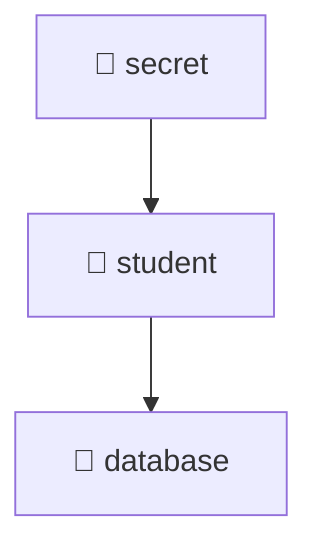

✔ First secret created successfully.

---

## Step 3 — Read the Secret

Click

```
student
   ↓
database
```

---

## Vault Displays

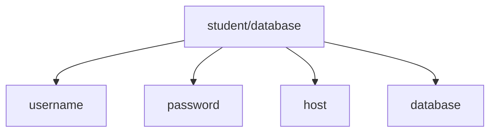

You should now see all four values.

---

## Step 4 — Create Another Secret

Click

```
Create Secret
```

Secret Path

```
student/application
```

### Values

| Key | Value |
|------|-------|
| api_key | abc123xyz |
| environment | dev |
| url | https://api.openhelp.net |

Click **Save**

---

## Vault Structure

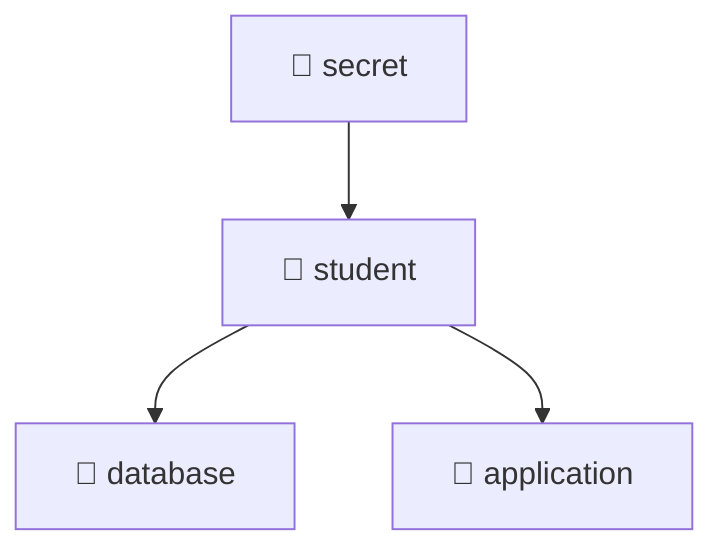

Now the **student** folder contains two secrets.

---

## Step 5 — Create Finance Secret

Click

```
Create Secret
```

Secret Path

```
finance/mysql
```

### Values

| Key | Value |
|------|-------|
| username | finance |
| password | finance123 |
| host | mysql |
| database | finance_db |

Click **Save**

---

## Vault Structure

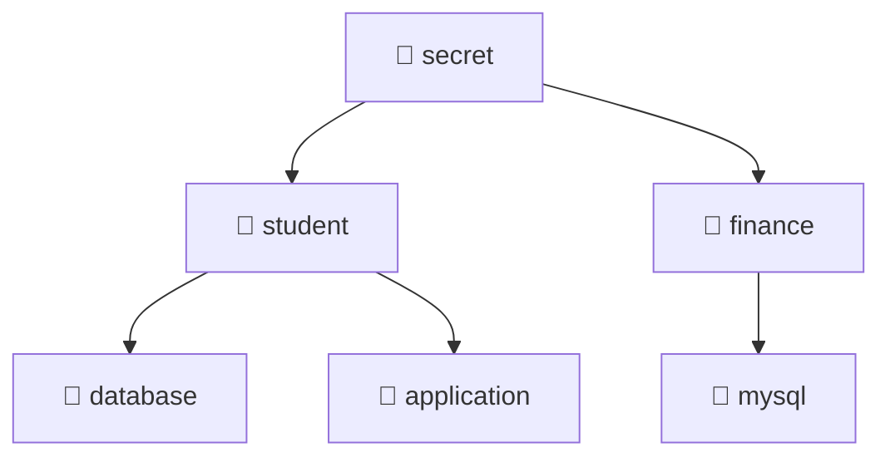

Now your Vault looks like this.

```
secret

├── student
│   ├── database
│   └── application
│
└── finance
    └── mysql
```

Now you're starting to understand the Vault directory structure.

---

## Step 6 — Secret Versioning

Open

```
student/database
```

Click

```
Edit
```

Change

```
Password123
```

to

```
Password456
```

Click **Save**

---

## What Happens?

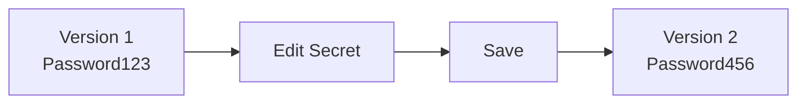

Vault automatically creates **Version 2**.

The previous version is still stored and can be restored later if required.

---

## Final Vault Structure

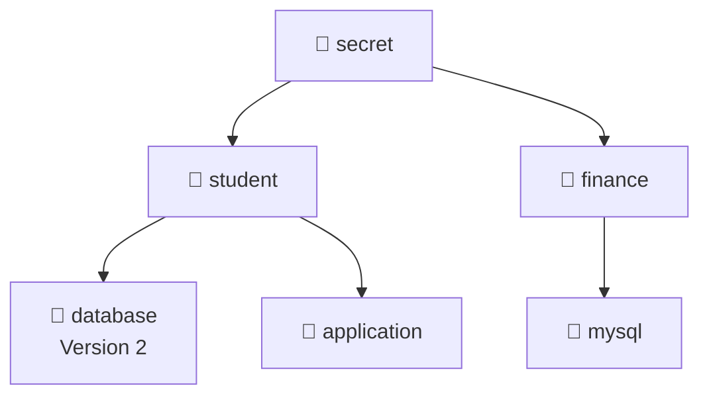

---

## Lab Summary

✅ Created secrets

✅ Learned Vault folder structure

✅ Read stored secrets

✅ Created multiple secret paths

✅ Understood secret versioning

You're now ready to inject these secrets into Kubernetes Pods using the **Vault Agent Injector**.


# Real time example to understand Hashicorp vault better: Employee Visiting a Bank Without a Valid ID

Before learning the technical details of HashiCorp Vault, let's first understand how it works using a simple bank example. Real-world examples are often easier to understand than technical diagrams. In this guide, we will compare Vault to a high-security bank, where every step in the bank has an equivalent component in Vault and Kubernetes.
Once you understand this simple story, concepts such as ServiceAccount JWT, Kubernetes authentication, Vault Roles, Policies, Vault Tokens, and Secrets will become much easier to understand.

Imagine there is a company called **ABC Ltd.**

The company stores all its money in a High Security Bank.

The bank never trusts anyone directly.

## Characters

-   🏦 Bank = HashiCorp Vault
-   👮 Security Guard = Kubernetes Authentication
-   👨 Employee = Kubernetes Pod
-   🆔 Employee ID = ServiceAccount JWT
-   🎫 Visitor Pass = Vault Token
-   💰 Locker = Secret (Password/API Key)
-   📋 Permission Letter = Vault Policy
-   👔 HR Database = Kubernetes API Server (TokenReview)

------------------------------------------------------------------------

# Step 1 --- Employee goes to the bank

Employee asks the bank officer:

> "I need the locker key."

The bank officer says:

> "Show your ID."

Employee does **NOT** have a passport for verification.

Instead he has a **Company Employee Card of ABC Ltd.**

This is exactly like the **ServiceAccount JWT** of a Pod.

JWT in Kubernetes means JSON Web Token. It is a signed token used to prove identity.

In Kubernetes, a JWT is commonly created for a ServiceAccount.

Kubernetes gives the Pod a JWT token. The Pod can use that token to tell the Kubernetes API:

“I am the ServiceAccount my-app-sa from this namespace.”

Every Pod that uses a ServiceAccount automatically gets a ServiceAccount
JWT mounted by Kubernetes. This JWT is not created by Vault; it is
created by Kubernetes.

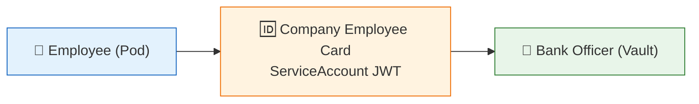

Let's see exactly where it is stored and what it contains.

Suppose we create a Pod:

``` yaml
apiVersion: v1
kind: Pod
metadata:
  name: demo
spec:
  serviceAccountName: vault-demo
```

When the Pod starts,

Kubernetes automatically creates a projected ServiceAccount Token and
mounts it inside the Pod.

Path inside Pod:

``` text
/var/run/secrets/kubernetes.io/serviceaccount/token
```

It has:

-   Namespace
-   ServiceAccount
-   Pod name
-   Pod UID
-   Expiry
-   Audience
-   Issuer

To see the token:

``` bash
TOKEN=$(cat /var/run/secrets/kubernetes.io/serviceaccount/token)

echo "$TOKEN" | \
cut -d '.' -f2 | \
tr '_-' '/+' | \
awk '{l=length($0)%4; if(l==2)printf "%s==",$0; else if(l==3)printf "%s=",$0; else print}' | \
base64 -d | jq .
```

Example output:

``` json
{
  "aud":["https://kubernetes.default.svc"],
  "exp":1780000000,
  "iat":1779996400,
  "iss":"https://kubernetes.default.svc",
  "kubernetes.io":{
    "namespace":"vault-demo",
    "node":{"name":"kube5.openhelp.net","uid":"d1d93d2d-xxxx-xxxx"},
    "pod":{"name":"kv-inject-demo","uid":"81f4xxxx-xxxx"},
    "serviceaccount":{"name":"vault-demo","uid":"fa18c3xxxx-xxxx"}
  },
  "nbf":1779996400,
  "sub":"system:serviceaccount:vault-demo:vault-demo"
}
```

------------------------------------------------------------------------

# Step 2 --- Can the bank trust this ID?

**No.**

Anyone can print a fake card.

So the bank officer phones ABC company HR and asks whether the employee
is genuine.

If everything matches, HR approves.

This is equivalent to Vault asking Kubernetes to validate the JWT.

Kubernetes checks JWT Signature, Expiry, Namespace and ServiceAccount
Name.

Kubernetes API Server queries the ServiceAccount object stored in etcd.

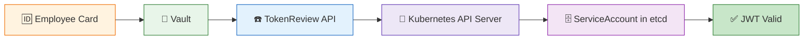

------------------------------------------------------------------------

# Step 3 --- Is this employee allowed to access locker?

The employee is genuine.

Now the bank officer checks whether the employee has permission. only bank employee with finance role can have access to locker.

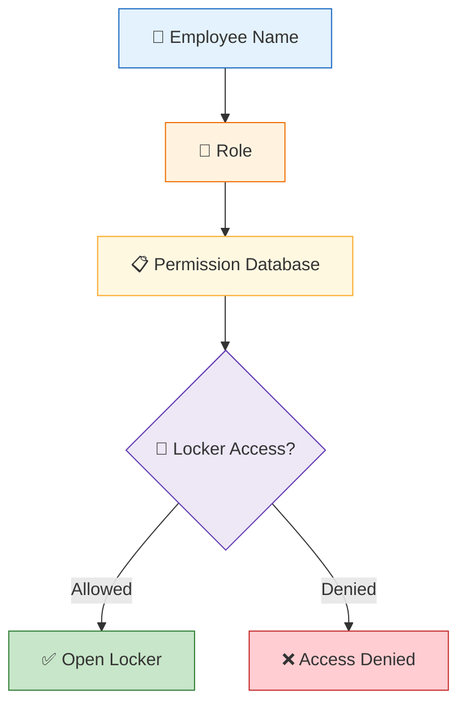

This is equivalent to Vault validating the JWT, checking the Vault Role
and Vault Policy.

Example:

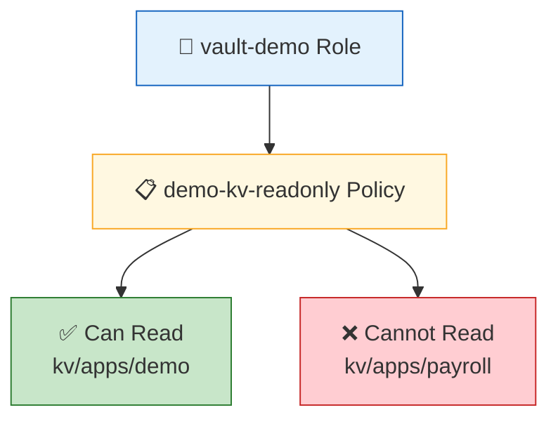

------------------------------------------------------------------------

# Step 4 --- Employee is NOT given the locker key

The bank officer never gives the permanent locker key.  because it would be unsafe,  ABC employee can  go home with the key, he can leave  leave the company but still have the key. The key never expire and it is unsafe
Due to this reasons Bank officer just  gives a temporary visitor pass valid for 1 hour.

This is equivalent to Vault creating a temporary Vault Token.

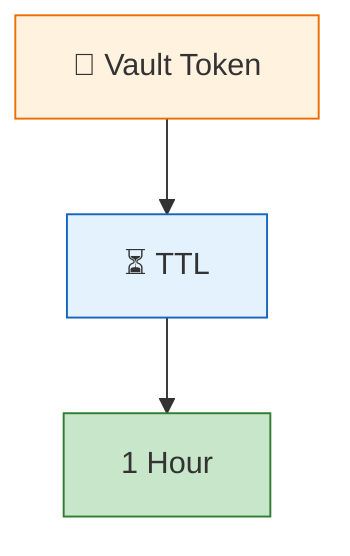

------------------------------------------------------------------------

# Step 5 --- Employee goes to the locker room

Employee shows the temporary visitor pass to the security of locker room .

Equivalent: Pod submits the temporary Vault Token and requests the
secret.

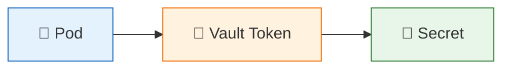

------------------------------------------------------------------------

# Step 6 --- Security checks the visitor pass

Security checks the visitor pass.

If valid and not expired, the locker is opened.

Otherwise the employee must go back to reception.

Equivalent:

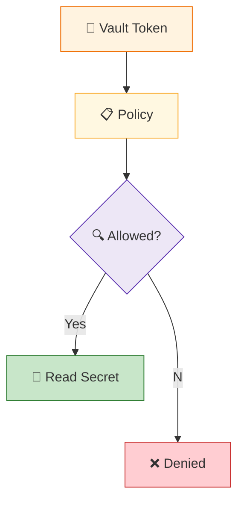


## 17.1 Enable KV v2

```bash
kubectl exec -n vault vault-0 -- \
  sh -c "VAULT_TOKEN='${VAULT_ROOT_TOKEN}' \
  vault secrets enable -path=kv kv-v2"
```
This may fail , Vault is telling you that the KV secrets engine is already enabled .
Check it with:

```bash
root@kube2:~/vault-tls# kubectl exec -n vault vault-0 -- \
  sh -c "VAULT_TOKEN='${VAULT_ROOT_TOKEN}' \
  vault secrets list -detailed"
Path               Plugin            Accessor                   Default TTL    Max TTL    Force No Cache    Replication    Seal Wrap    External Entropy Access    Options           Description                                                UUID                                    Version    Running Version         Running SHA256    Deprecation Status
----               ------            --------                   -----------    -------    --------------    -----------    ---------    -----------------------    -------           -----------                                                ----                                    -------    ---------------         --------------    ------------------
agent-registry/    agent_registry    agent-registry_e2699120    system         system     false             replicated     false        false                      map[]             agent registry                                             8d272179-85e9-0f33-b2f8-049d3375a1fa    n/a        v2.0.3+builtin.vault    n/a               n/a
cubbyhole/         cubbyhole         cubbyhole_9341e0ac         n/a            n/a        false             local          false        false                      map[]             per-token private secret storage                           733fd288-cd94-1238-5958-5fbd3adbb4d2    n/a        v2.0.3+builtin.vault    n/a               n/a
identity/          identity          identity_cd5daeee          system         system     false             replicated     false        false                      map[]             identity store                                             9f7f5cc9-8856-fe60-eb1b-2ef2c3aed716    n/a        v2.0.3+builtin.vault    n/a               n/a
kv/                kv                kv_3bef8346                system         system     false             replicated     false        false                      map[version:2]    n/a                                                        8b529e54-fd5f-d2f0-cba1-6e7115b22397    n/a        v0.26.2+builtin         n/a               supported
ssh/               ssh               ssh_ed0d2337               system         system     false             replicated     false        false                      map[]             n/a                                                        d2a90c1c-0f11-cea2-c106-80f01a8bd053    n/a        v2.0.3+builtin.vault    n/a               supported
sys/               system            system_fdcbca3b            n/a            n/a        false             replicated     true         false                      map[]             system endpoints used for control, policy and debugging    c600831c-967a-cff4-07b7-35ef92d76218    n/a        v2.0.3+builtin.vault    n/a               n/a
root@kube2:~/vault-tls#
```


Now create your first secret:

```bash

kubectl exec -n vault vault-0 -- \
  sh -c "VAULT_TOKEN='${VAULT_ROOT_TOKEN}' \
  vault kv put kv/myapp \
  username=admin \
  password='MySecurePassword123'"
```

Read the secret:

```bash
root@kube2:~/vault-tls# kubectl exec -n vault vault-0 -- \
  sh -c "VAULT_TOKEN='${VAULT_ROOT_TOKEN}' \
  vault kv get kv/myapp"
```

Read only the password:
```bash
kubectl exec -n vault vault-0 -- \
  sh -c "VAULT_TOKEN='${VAULT_ROOT_TOKEN}' \
  vault kv get -field=password kv/myapp"
```

List secrets under kv/:

```bash
kubectl exec -n vault vault-0 -- \
  sh -c "VAULT_TOKEN='${VAULT_ROOT_TOKEN}' \
  vault kv list kv/"
```

Update one value:

```bash
kubectl exec -n vault vault-0 -- \
  sh -c "VAULT_TOKEN='${VAULT_ROOT_TOKEN}' \
  vault kv patch kv/myapp \
  password='NewPassword456'"
```


## 17.2 Create the policy

Store a test secret:

```bash
kubectl exec -n vault vault-0 -- sh -c "
  VAULT_TOKEN='${VAULT_ROOT_TOKEN}' \
  vault kv put kv/apps/demo \
    username='demo-user' \
    password='DemoPassword-ChangeMe'
"
```


Create `demo-kv-policy.hcl`:

```bash
cat > demo-kv-readonly-policy.hcl <<'EOF'
# Allow reading only the secret kv/apps/demo
path "kv/data/apps/demo" {
  capabilities = ["read"]
}
# Allow listing secret names under kv/
path "kv/metadata/" {
  capabilities = ["list"]
}
EOF
```


Copy and apply:

```bash
kubectl cp demo-kv-readonly-policy.hcl vault/vault-0:/tmp/demo-kv-readonly-policy.hcl
```

Now create the policy in Vault:

```bash
kubectl exec -n vault vault-0 -- sh -c "
  VAULT_TOKEN='${VAULT_ROOT_TOKEN}' \
  vault policy write demo-kv-readonly /tmp/demo-kv-readonly-policy.hcl
"
```

List all policies
```bash
root@kube2:~/vault-tls# kubectl exec -n vault vault-0 -- \
  sh -c "VAULT_TOKEN='${VAULT_ROOT_TOKEN}' \
  vault policy list"

```
Read the policy from Vault

```bash

kubectl exec -n vault vault-0 -- \
  sh -c "VAULT_TOKEN='${VAULT_ROOT_TOKEN}' \
  vault policy read demo-kv-readonly"
```


# Part 2: Create a token using the policy
Step 8: Create a limited token

Create a token with:

Policy: demo-kv-readonly 
Lifetime: one hour

```bash
kubectl exec -n vault vault-0 -- \
  sh -c "VAULT_TOKEN='${VAULT_ROOT_TOKEN}' \
  vault token create \
  -policy=demo-kv-readonly  \
  -ttl=1h"
```

Save the limited token automatically


```bash
export MYAPP_TOKEN=$(
  kubectl exec -n vault vault-0 -- \
    sh -c "VAULT_TOKEN='${VAULT_ROOT_TOKEN}' \
    vault token create \
    -policy=demo-kv-readonly \
    -ttl=1h \
    -field=token"
)
```
Confirm that the variable is populated:


```bash
root@kube2:~/vault-tls# echo "${MYAPP_TOKEN}"
hvs.CAESIEqnCTLSLKM1BB4Ja-aQhvaF-P_GGFExyytdhV1ozkK3Gh4KHGh2cy5nMHlmYjk1Qkp3UFdCaVk0RjZJY3Voem
```

Check the token details

```bash
kubectl exec -n vault vault-0 -- \
  sh -c "VAULT_TOKEN='${MYAPP_TOKEN}' \
  vault token lookup"
```

Check the token’s exact capabilities

```bash
root@kube2:~/vault-tls# kubectl exec -n vault vault-0 --   sh -c "VAULT_TOKEN='${MYAPP_TOKEN}' \
  vault token capabilities kv/data/apps/demo"
read

```
Check access to the metadata path:


```bash
root@kube2:~/vault-tls# kubectl exec -n vault vault-0 -- \
  sh -c "VAULT_TOKEN='${MYAPP_TOKEN}' \
  vault token capabilities kv/metadata/"
list

```
Check access to a different secret:

```bash
root@kube2:~/vault-tls# kubectl exec -n vault vault-0 -- \
  sh -c "VAULT_TOKEN='${MYAPP_TOKEN}' \
  vault token capabilities kv/data/anotherapp"
deny

```

Read the allowed secret

```bash
root@kube2:~/vault-tls# kubectl exec -n vault vault-0 --   sh -c "VAULT_TOKEN='${MYAPP_TOKEN}' \
  vault kv get kv/apps/demo"
== Secret Path ==
kv/data/apps/demo

======= Metadata =======
Key                Value
---                -----
created_time       2026-07-15T05:44:49.375004115Z
custom_metadata    <nil>
deletion_time      n/a
destroyed          false
version            2

====== Data ======
Key         Value
---         -----
password    DemoPassword-ChangeMe
username    demo-user
```

List secret names

```bash
root@kube2:~/vault-tls# kubectl exec -n vault vault-0 -- \
  sh -c "VAULT_TOKEN='${MYAPP_TOKEN}' \
  vault kv list kv/"
Keys
----
apps/
finance/
myapp
student/
```

Revoke the limited token

After testing, revoke it:

```bash
root@kube2:~/vault-tls# kubectl exec -n vault vault-0 -- \
  sh -c "VAULT_TOKEN='${VAULT_ROOT_TOKEN}' \
  vault token revoke '${MYAPP_TOKEN}'"
Success! Revoked token (if it existed)
```

## 17.3 Create the Kubernetes auth role

We create the vault-demo role to define which Kubernetes Pod is allowed to log in to Vault and what it can access.

It allows only the vault-demo ServiceAccount from the vault-demo namespace to authenticate using its Kubernetes JWT.

After successful authentication, Vault gives the Pod a temporary token with the demo-kv-readonly policy for one hour.

```bash
kubectl exec -n vault vault-0 -- sh -c "
  VAULT_TOKEN='${VAULT_ROOT_TOKEN}' \
  vault write auth/kubernetes/role/vault-demo \
    bound_service_account_names='vault-demo' \
    bound_service_account_namespaces='vault-demo' \
    policies='demo-kv-readonly' \
    audience='vault' \
    ttl='1h'
"
```

The important thing is that auth/kubernetes/role/vault-demo is NOT a secret path. It is a configuration path inside Vault's Kubernetes authentication engine.

What is stored inside this role?

Below details will be saved:-
```bash
Role Name
──────────────
vault-demo

Allowed ServiceAccount
────────────────────────
vault-demo

Allowed Namespace
──────────────────────
vault-demo

Policy
──────────────────────
demo-kv-readonly

Token TTL
──────────────────────
1 hour
```

## 17.4 Copy the FreeIPA CA to the demo namespace

```bash
kubectl -n vault get configmap vault-ca \
  -o jsonpath='{.data.ca\.crt}' > freeipa-ca.crt

kubectl -n vault-demo create secret generic vault-ca \
  --from-file=ca.crt=freeipa-ca.crt
```


# HashiCorp Vault + Kubernetes Authentication + Agent Injector (Beginner Guide)

> **Objective**
>
> Learn how Kubernetes authenticates to Vault using a ServiceAccount JWT, how Vault validates the JWT, issues a Vault Token, and how the Vault Agent Injector securely injects secrets into a Pod.

---

# End-to-End Authentication Workflow


---

# Authentication Flow Explained

1. Kubernetes automatically mounts a **projected ServiceAccount JWT** into the Pod.
2. The **Vault Agent Init Container** reads this JWT.
3. The agent authenticates to Vault using the Kubernetes Auth Method.
4. Vault sends the JWT to the Kubernetes TokenReview API for validation.
5. Kubernetes confirms:
   - JWT signature
   - ServiceAccount name
   - Namespace
   - Token validity
6. Vault compares the authenticated identity against the configured Vault Role.
7. If allowed, Vault creates a **temporary Vault Token** (TTL 1 hour in this lab).
8. Using this Vault Token, the agent reads the KV secret.
9. The template renders the secret into `/vault/secrets/demo-secrets`.
10. The application reads the generated file.
11. The sidecar keeps the token renewed and refreshes secrets when required.

---


# Step 1 Create the ServiceAccount

```bash
kubectl create namespace vault-demo

kubectl create serviceaccount vault-demo -n vault-demo
```

Verify

```bash
kubectl get sa -n vault-demo
```

---

# Step 2 Verify the Secret Exists

```bash
kubectl exec -n vault vault-0 -- sh -c "
VAULT_TOKEN='${VAULT_ROOT_TOKEN}' \
vault kv get kv/apps/demo
"
```

Expected

```
username
password
```

---

# Step 3 Create the Policy

Create the policy

```bash
cat > demo-kv-readonly-policy.hcl <<EOF
path "kv/data/apps/demo" {
  capabilities = ["read"]
}

path "kv/metadata/apps" {
  capabilities = ["list"]
}
EOF
```

Copy to Vault

```bash
kubectl cp demo-kv-readonly-policy.hcl \
vault/vault-0:/tmp/demo-kv-readonly-policy.hcl
```

Create the policy

```bash
kubectl exec -n vault vault-0 -- sh -c "
VAULT_TOKEN='${VAULT_ROOT_TOKEN}' \
vault policy write demo-kv-readonly \
/tmp/demo-kv-readonly-policy.hcl
"
```

Verify

```bash
kubectl exec -n vault vault-0 -- sh -c "
VAULT_TOKEN='${VAULT_ROOT_TOKEN}' \
vault policy read demo-kv-readonly
"
```

---

### What happens?

- Policy defines what a Vault Token is allowed to access.
- This policy grants:
  - Read access to `kv/data/apps/demo`
  - List access to `kv/metadata/apps`

---

# Step 4 Create the Kubernetes Authentication Role
We create the vault-demo role to define which Kubernetes Pod is allowed to log in to Vault and what it can access.

It allows only the vault-demo ServiceAccount from the vault-demo namespace to authenticate using its Kubernetes JWT.

After successful authentication, Vault gives the Pod a temporary token with the demo-kv-readonly policy for one hour.

> **Do NOT configure an audience.** The default projected Kubernetes service account token works correctly without a custom audience.

```bash
kubectl exec -n vault vault-0 -- sh -c "
VAULT_TOKEN='${VAULT_ROOT_TOKEN}' \
vault write auth/kubernetes/role/vault-demo \
bound_service_account_names='vault-demo' \
bound_service_account_namespaces='vault-demo' \
policies='demo-kv-readonly' \
audience='vault' \
ttl='1h'
"
```

Verify

```bash
kubectl exec -n vault vault-0 -- sh -c "
VAULT_TOKEN='${VAULT_ROOT_TOKEN}' \
vault read auth/kubernetes/role/vault-demo
"
```

Expected

```
bound_service_account_names

bound_service_account_namespaces

policies

ttl
```

Notice there is no audience field.

---

### What happens?

Vault Role binds:

- Kubernetes ServiceAccount
- Namespace
- Vault Policy
- Token TTL

Only this ServiceAccount can obtain the policy.

---

# Step 5 Copy the Vault CA

Copy the FreeIPA CA from Vault namespace

```bash
kubectl -n vault get configmap vault-ca \
-o jsonpath='{.data.ca\.crt}' \
> freeipa-ca.crt
```

Create the Secret

```bash
kubectl create secret generic vault-ca \
-n vault-demo \
--from-file=ca.crt=freeipa-ca.crt
```

Verify

```bash
kubectl get secret -n vault-demo
```

---

### Why?

The Vault Agent must trust the TLS certificate presented by Vault.

---

# Step 6 Create the Demo Pod

Notice we use the internal Vault service, not the external MetalLB IP.

```yaml
cat > vault-secret-demo.yaml <<'EOF'
apiVersion: v1
kind: Pod
metadata:
  name: vault-secret-demo
  namespace: vault-demo
  labels:
    app: vault-secret-demo
  annotations:
    vault.hashicorp.com/agent-inject: "true"
    vault.hashicorp.com/role: "vault-demo"

    # Tell Vault Agent to use the custom projected token below
    vault.hashicorp.com/agent-service-account-token-volume-name: "vault-token"

    vault.hashicorp.com/service: "https://vault-active.vault.svc:8200"
    vault.hashicorp.com/tls-server-name: "vault.openhelp.net"
    vault.hashicorp.com/tls-secret: "vault-ca"
    vault.hashicorp.com/ca-cert: "/vault/tls/ca.crt"

    vault.hashicorp.com/agent-inject-secret-demo-secrets: "kv/data/apps/demo"
    vault.hashicorp.com/agent-inject-template-demo-secrets: |
      {{- with secret "kv/data/apps/demo" -}}
      export DEMO_USERNAME="{{ .Data.data.username }}"
      export DEMO_PASSWORD="{{ .Data.data.password }}"
      {{- end }}

spec:
  serviceAccountName: vault-demo
  restartPolicy: Never

  volumes:
    # Kubernetes generates a short-lived JWT specifically for Vault
    - name: vault-token
      projected:
        sources:
          - serviceAccountToken:
              path: token
              audience: vault
              expirationSeconds: 3600

  containers:
    - name: app
      image: busybox:1.36
      command:
        - /bin/sh
        - -c
      args:
        - |
          echo "Vault Agent completed secret injection."
          . /vault/secrets/demo-secrets
          echo "Username received from Vault: ${DEMO_USERNAME}"
          echo "Password loaded successfully."
          echo "Password length: ${#DEMO_PASSWORD}"
          echo "Application is running."
          sleep 3600
EOF
```

# Vault Secret Injection YAML - Parameter Explanation

| YAML Line | Why We Use It |
|------------|---------------|
| `apiVersion: v1` | Specifies the Kubernetes API version used to create the Pod. |
| `kind: Pod` | Creates a Kubernetes Pod resource. |
| `metadata:` | Contains information that identifies the Pod. |
| `name: vault-secret-demo` | Gives the Pod a unique name. |
| `namespace: vault-demo` | Creates the Pod inside the `vault-demo` namespace. |
| `labels:` | Adds labels to identify the Pod. |
| `app: vault-secret-demo` | Labels the Pod so Services or administrators can easily find it. |
| `annotations:` | Stores Vault-specific configuration for the Pod. |
| `vault.hashicorp.com/agent-inject: "true"` | Enables automatic Vault Agent injection into the Pod. |
| `vault.hashicorp.com/role: "vault-demo"` | Tells Vault which Kubernetes authentication role the Pod should use. |
| `vault.hashicorp.com/service: "https://vault-active.vault.svc:8200"` | Specifies the Vault server address used by the Vault Agent. |
| `vault.hashicorp.com/tls-server-name: "vault.openhelp.net"` | Verifies that the Vault TLS certificate belongs to `vault.openhelp.net`. |
| `vault.hashicorp.com/tls-secret: "vault-ca"` | Specifies the Kubernetes Secret containing the trusted CA certificate. |
| `vault.hashicorp.com/ca-cert: "/vault/tls/ca.crt"` | Tells Vault Agent where the CA certificate is mounted inside the Pod. |
| `vault.hashicorp.com/agent-inject-secret-demo-secrets: "kv/data/apps/demo"` | Specifies the Vault secret path that should be read. |
| `vault.hashicorp.com/agent-inject-template-demo-secrets:` | Defines how the retrieved secret should be written into a file. |
| `{{- with secret "kv/data/apps/demo" -}}` | Reads the secret from the specified Vault KV path. |
| `export DEMO_USERNAME="{{ .Data.data.username }}"` | Writes the Vault username as an environment variable. |
| `export DEMO_PASSWORD="{{ .Data.data.password }}"` | Writes the Vault password as an environment variable. |
| `{{- end }}` | Ends the Vault template block. |
| `spec:` | Defines how the Pod should run. |
| `serviceAccountName: vault-demo` | Uses the `vault-demo` ServiceAccount to authenticate with Vault. |
| `restartPolicy: Never` | Prevents Kubernetes from restarting the Pod after it exits. |
| `containers:` | Defines the containers that will run inside the Pod. |
| `name: app` | Sets the application container name. |
| `image: busybox:1.36` | Uses the BusyBox image for this demonstration. |
| `command:` | Specifies the command used to start the container. |
| `/bin/sh` | Starts a Linux shell inside the container. |
| `-c` | Executes the script provided in the `args` section. |
| `args:` | Contains the shell commands executed after the container starts. |
| `echo "Vault Agent completed secret injection."` | Displays a message confirming the application has started. |
| `. /vault/secrets/demo-secrets` | Loads the secret file created by Vault into the current shell. |
| `echo "Username received from Vault: ${DEMO_USERNAME}"` | Prints the username retrieved from Vault. |
| `echo "Password loaded successfully."` | Confirms the password was loaded without displaying it. |
| `echo "Password length: ${#DEMO_PASSWORD}"` | Displays only the password length to verify it was received securely. |
| `echo "Application is running."` | Displays a message indicating the application is running. |
| `sleep 3600` | Keeps the Pod running for one hour so it can be inspected and tested. |


Deploy

```bash
kubectl apply -f vault-secret-demo.yaml
```

---

# Step 7 Watch the Pod

```bash
kubectl get pod -n vault-demo -w
```

Expected

```
Init:0/1

↓

PodInitializing

↓

Running

2/2
```

---

# Step 8 Verify the Injector

```bash
kubectl get pod \
-n vault-demo vault-secret-demo \
-o jsonpath='{.spec.initContainers[*].name}{"\n"}{.spec.containers[*].name}{"\n"}'
```

Expected

```
vault-agent-init

app

vault-agent
```

---

# Step 9 Check Vault Agent Logs

```bash
kubectl logs \
-n vault-demo \
vault-secret-demo \
-c vault-agent-init
```

Expected

```
7-18T10:26:57.044Z [INFO]  agent.sink.file: creating file sink
2026-07-18T10:26:57.143Z [INFO]  agent.sink.file: file sink configured: path=/home/vault/.vault-token mode=-rw-r----- owner=100 group=1000
2026-07-18T10:26:57.267Z [INFO]  agent.auth.handler: starting auth handler
2026-07-18T10:26:57.296Z [INFO]  agent.exec.server: starting exec server
2026-07-18T10:26:57.297Z [INFO]  agent.exec.server: no env templates or exec config, exiting
2026-07-18T10:26:57.307Z [INFO]  agent.auth.handler: authenticating
2026-07-18T10:26:57.331Z [INFO]  agent.template.server: starting template server
2026-07-18T10:26:57.370Z [INFO]  agent.sink.server: starting sink server
2026-07-18T10:26:57.379Z [INFO]  agent: (runner) creating new runner (dry: false, once: false)
2026-07-18T10:26:57.504Z [INFO]  agent: (runner) creating watcher
2026-07-18T10:26:59.382Z [INFO]  agent.auth.handler: authentication successful, sending token to sinks
2026-07-18T10:26:59.383Z [INFO]  agent.auth.handler: starting renewal process
2026-07-18T10:26:59.383Z [INFO]  agent.sink.file: token written: path=/home/vault/.vault-token
2026-07-18T10:26:59.384Z [INFO]  agent.sink.server: sink server stopped
2026-07-18T10:26:59.384Z [INFO]  agent: sinks finished, exiting
2026-07-18T10:26:59.384Z [INFO]  agent.template.server: template server received new token
2026-07-18T10:26:59.384Z [INFO]  agent: (runner) stopping
2026-07-18T10:26:59.384Z [INFO]  agent: (runner) creating new runner (dry: false, once: false)
2026-07-18T10:26:59.384Z [INFO]  agent: (runner) creating watcher
2026-07-18T10:26:59.385Z [INFO]  agent: (runner) starting

```

---

# Step 10 Check Application Logs

```bash
kubectl logs \
-n vault-demo \
vault-secret-demo \
-c app
```

Expected

```
Vault Agent completed secret injection.
Username received from Vault:
Password loaded successfully.
Password length: 0
Application is running.
```

---

# Step 11 Verify the Injected Secret

```bash
kubectl exec \
-n vault-demo \
vault-secret-demo \
-c app -- \
cat /vault/secrets/demo-secrets
```

Expected

```
export DEMO_USERNAME="demo-user"

export DEMO_PASSWORD="DemoPassword-ChangeMe"
```


# Step 12 Cleanup

```bash
kubectl delete pod \
-n vault-demo \
vault-secret-demo
```

---

# Complete Sequence Diagram

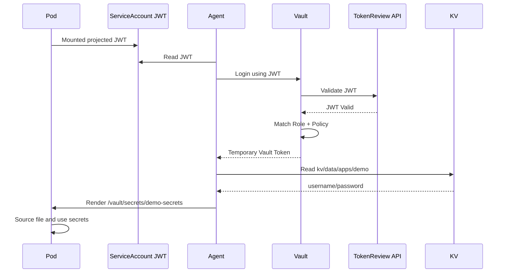


#  Uninstall and Cleanup

## 1 Delete demonstration workloads

```bash
kubectl delete namespace vault-demo
kubectl delete namespace database
```

## 2 Delete monitoring and LoadBalancer resources

```bash
kubectl delete -f vault-monitoring.yaml
kubectl delete -f vault-active-lb.yaml
```

## 3 Uninstall the Helm release

```bash
helm uninstall vault -n vault
```

## 4 PVC retention warning

The values intentionally retain data PVCs. Verify before deletion:

```bash
kubectl get pvc -n vault
```

Only when data destruction is intended:

```bash
kubectl delete pvc -n vault \
  data-vault-0 data-vault-1 data-vault-2 \
  audit-vault-0 audit-vault-1 audit-vault-2
```

Delete the namespace:

```bash
kubectl delete namespace vault
```

Remove FreeIPA DNS/service entries only when the endpoint is permanently retired.

---


---

# Official References

- HashiCorp Vault Kubernetes Helm documentation
- HashiCorp HA with Integrated Storage (Raft) example
- HashiCorp Kubernetes authentication documentation
- HashiCorp Vault Agent Injector documentation
- HashiCorp MySQL/MariaDB database secrets engine documentation
- HashiCorp Vault telemetry documentation
- HashiCorp Raft snapshot documentation
- HashiCorp Vault Helm chart `values.yaml`

The guide was prepared against Vault Helm chart `0.33.0` and Vault `2.0.x`. Before installing a later version, review the official release notes and render the chart with `helm template` and `--dry-run`.
