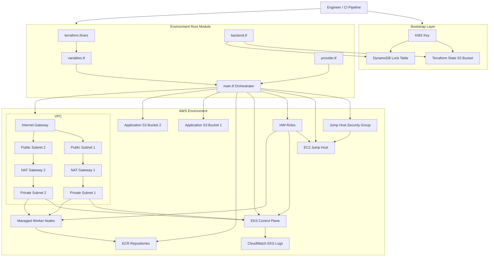
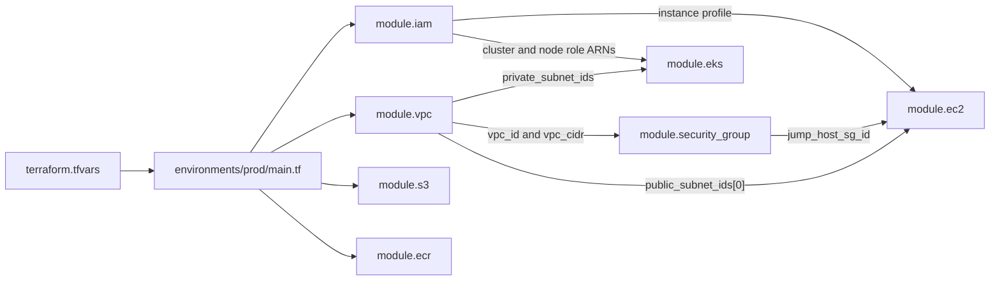
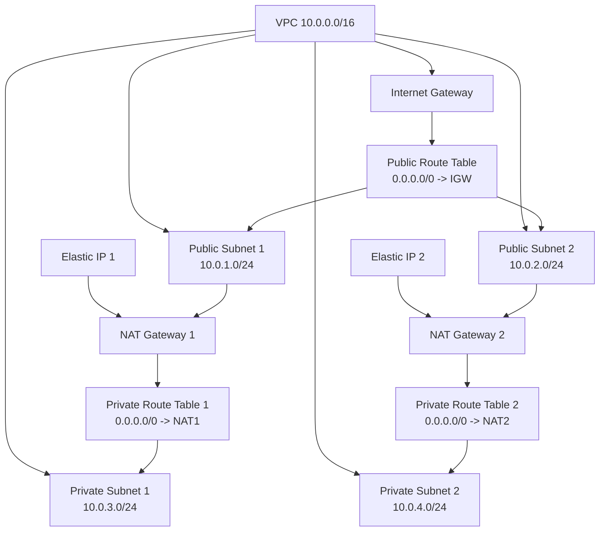
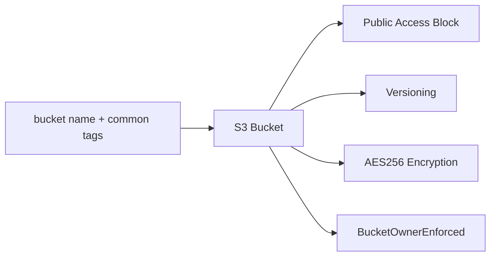
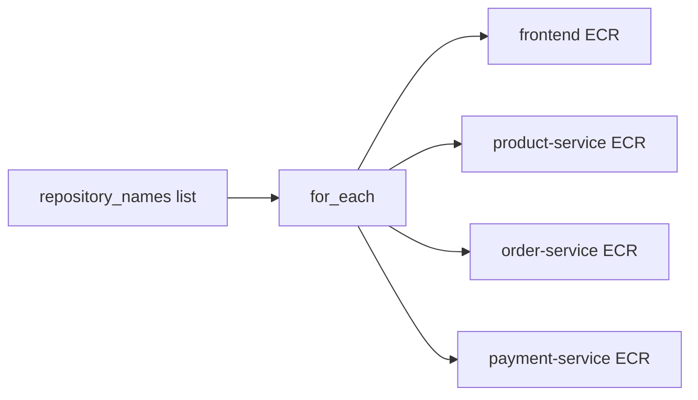
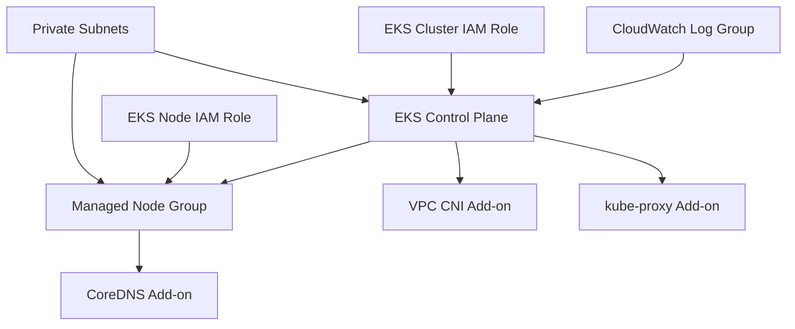
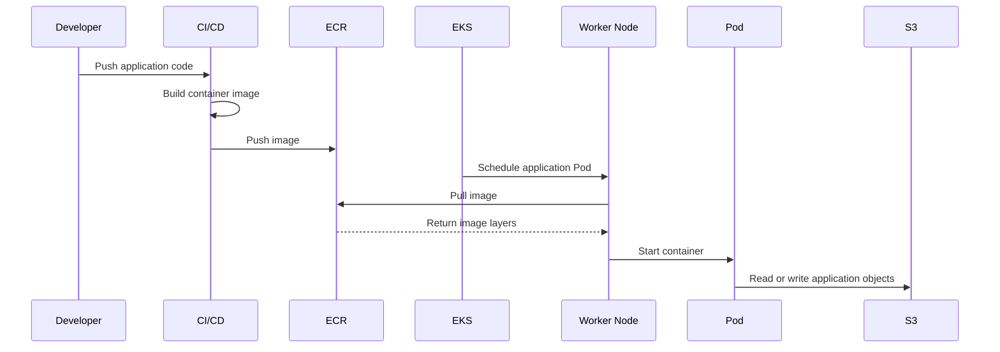

# Terraform AWS EKS Architecture and Complete Execution Flow

## 1. What This Repository Builds

This Terraform repository creates three separate AWS environments:

- `dev`
- `test`
- `prod`

Each environment can create:

- VPC
- Two public subnets
- Two private subnets
- Internet Gateway
- NAT Gateway or NAT Gateways
- Route tables
- Terraform backend S3 bucket
- DynamoDB locking table
- KMS key for Terraform state
- Two application S3 buckets
- ECR repositories
- IAM roles
- EC2 jump host
- EKS cluster
- EKS managed node group
- EKS add-ons
- CloudWatch log group

The project follows a modular architecture:

```text
Environment configuration
        |
        v
Root main.tf orchestrator
        |
        +--> VPC module
        +--> S3 module
        +--> ECR module
        +--> IAM module
        +--> Security Group module
        +--> EC2 module
        +--> EKS module
```

---

## 2. High-Level Architecture



---

# 3. Why the `bootstrap` Directory Is Required

Terraform normally stores infrastructure information in a file called:

```text
terraform.tfstate
```

The state file contains information such as:

- AWS resource IDs
- VPC ID
- subnet IDs
- bucket names
- IAM role ARNs
- EKS cluster information
- resource dependencies
- previous Terraform values

For a team or production environment, storing this file only on one engineer's laptop is unsafe.

The repository therefore stores Terraform state remotely in S3.

However, Terraform cannot use an S3 backend before the S3 bucket exists. This creates a dependency problem:

```text
Terraform needs the bucket to store state
but
Terraform must first create the bucket
```

The `bootstrap` directory solves this problem.

## Bootstrap execution

```mermaid
sequenceDiagram
    participant Engineer
    participant Terraform
    participant AWS
    participant S3
    participant DynamoDB
    participant KMS

    Engineer->>Terraform: terraform apply in bootstrap/prod
    Terraform->>AWS: Create KMS key
    AWS-->>Terraform: KMS key ARN
    Terraform->>S3: Create state bucket
    Terraform->>S3: Enable versioning and public access block
    Terraform->>S3: Enable KMS encryption
    Terraform->>DynamoDB: Create locking table
    Terraform->>DynamoDB: Enable encryption and recovery
    Terraform-->>Engineer: Backend resources created
```



After bootstrap is created, `environments/prod/backend.tf` can use it.

---

# 4. Why We Use the Terraform State Bucket

The state bucket is not an application data bucket.

Its purpose is only to store Terraform state.

Example:

```hcl
terraform {
  backend "s3" {
    bucket         = "openhelp-terraform-state-prod-change-me-12345"
    key            = "prod/terraform.tfstate"
    region         = "us-east-1"
    dynamodb_table = "openhelp-terraform-lock-prod"
    encrypt        = true
  }
}
```

Meaning:

| Setting | Purpose |
|---|---|
| `bucket` | S3 bucket that stores Terraform state |
| `key` | Object path of the state file inside the bucket |
| `region` | AWS region containing the bucket |
| `dynamodb_table` | Prevents two Terraform processes from changing state together |
| `encrypt` | Requests encrypted state storage |

## Why state versioning is enabled

If the latest state is accidentally overwritten or damaged, an earlier S3 object version may be recovered.

## Why public access is blocked

Terraform state can contain sensitive infrastructure information. It must never be publicly accessible.

## Why KMS encryption is used

KMS provides managed encryption and key control for the Terraform state bucket and lock table.

## Why DynamoDB locking is used

Suppose two engineers execute `terraform apply` simultaneously:

```text
Engineer A --> changes EKS
Engineer B --> changes VPC
```

Without locking, both could update the same state and cause corruption.

DynamoDB stores a temporary lock record:

```text
LockID = prod/terraform.tfstate
```

Only one Terraform process can hold the lock at a time.

> Note: newer Terraform and S3 backend configurations may also support native S3 lock files. This repository currently uses the traditional DynamoDB locking design.

---

# 5. Why There Are Three S3 Buckets per Environment

The repository creates exactly three buckets for each environment.

## Bucket 1: Terraform state bucket

Created from:

```text
bootstrap/prod
```

Purpose:

```text
Stores prod/terraform.tfstate
```

This bucket belongs to Terraform operations, not the application.

## Bucket 2: Application bucket 1

Created from:

```text
modules/s3
```

Possible uses:

- frontend static files
- uploaded documents
- application assets
- reports
- data exports
- backup files

## Bucket 3: Application bucket 2

Also created from:

```text
modules/s3
```

Possible uses:

- logs
- artifacts
- processed files
- a second microservice's data
- separating public-facing and internal data
- separating input and output files

## Important finding

The current Terraform code creates the two application buckets, but no EC2 instance, EKS workload, IAM policy, or Kubernetes service is connected to them.

Therefore:

```text
The buckets exist
but
the current code does not yet define which application will use them
```

Their names `bucket1` and `bucket2` are placeholders. In a real project they should have meaningful names, for example:

```text
openhelp-prod-app-assets
openhelp-prod-audit-archive
```

---

# 6. Directory Responsibilities

```text
openhelp-prod-ready-terraform/
├── bootstrap/
│   ├── dev/
│   ├── test/
│   └── prod/
├── environments/
│   ├── dev/
│   ├── test/
│   └── prod/
└── modules/
    ├── vpc/
    ├── s3/
    ├── ecr/
    ├── iam/
    ├── security-group/
    ├── ec2/
    └── eks/
```

## `bootstrap/`

Creates the backend infrastructure used by Terraform itself.

## `environments/`

Contains the root modules for dev, test, and prod.

This is where Terraform commands for the real platform are executed.

## `modules/`

Contains reusable resource-building code.

A module is similar to a reusable function:

```text
Input variables
      |
      v
Terraform module
      |
      v
AWS resources + outputs
```

---

# 7. Root Environment Files

## `versions.tf`

Controls:

- minimum Terraform version
- AWS provider source
- AWS provider version range

## `provider.tf`

Configures the AWS provider.

```hcl
provider "aws" {
  region = var.region
}
```

It also adds default tags to resources.

## `backend.tf`

Tells Terraform where the state is stored.

Backend values are initialized during:

```bash
terraform init
```

Backend configuration is processed before normal variables and modules.

## `variables.tf`

Declares the input contract.

Example:

```hcl
variable "region" {
  type = string
}
```

This says that the root module requires a string named `region`.

## `terraform.tfvars`

Provides actual environment-specific values.

Example:

```hcl
region      = "us-east-1"
environment = "prod"
```

## `main.tf`

Acts as the orchestrator or connector.

It:

- calls every module
- passes values to modules
- connects module outputs to other module inputs
- establishes dependencies

## `outputs.tf`

Displays useful values after apply.

Example:

```text
EKS cluster name
EKS API endpoint
VPC ID
subnet IDs
ECR repository URLs
jump host public IP
```

---

# 8. Complete Terraform Command Execution Flow

When you execute:

```bash
cd environments/prod
terraform init
terraform plan
terraform apply
```

Terraform performs the following high-level process.

## Step 1: `terraform init`

Terraform:

1. Reads `versions.tf`.
2. Downloads the AWS provider.
3. Reads `backend.tf`.
4. Connects to the Terraform state S3 bucket.
5. Initializes state locking.
6. Downloads or initializes local modules.

## Step 2: Variable loading

Terraform combines values from:

```text
variable defaults
environment variables
terraform.tfvars
-var and -var-file command options
```

In this repository, most values come from `terraform.tfvars`.

## Step 3: Configuration loading

Terraform loads every `.tf` file in the directory as one combined root module.

Terraform does not execute files in filename order.

These files:

```text
main.tf
variables.tf
provider.tf
backend.tf
outputs.tf
versions.tf
```

are logically merged.

## Step 4: Dependency graph construction

Terraform analyzes references.

Example:

```hcl
vpc_id = module.vpc.vpc_id
```

This tells Terraform:

```text
VPC module must finish before security-group module
```

Example:

```hcl
subnet_id = module.vpc.public_subnet_ids[0]
```

This tells Terraform:

```text
Public subnet must exist before jump host
```

Example:

```hcl
private_subnet_ids = module.vpc.private_subnet_ids
```

This tells Terraform:

```text
Private subnets must exist before EKS cluster and worker nodes
```

## Step 5: `terraform plan`

Terraform:

1. Reads the current state from S3.
2. Refreshes known AWS resource status.
3. Compares desired configuration with actual infrastructure.
4. Builds a proposed change plan.
5. Does not create resources yet.

## Step 6: `terraform apply`

Terraform:

1. Acquires the state lock.
2. Creates resources according to the dependency graph.
3. Runs independent resources in parallel where possible.
4. Updates the state after successful changes.
5. Uploads the new state to S3.
6. Releases the lock.

---

# 9. Root `main.tf` Module Execution Flow



Terraform may create unrelated modules in parallel.

For example:

```text
VPC, IAM, S3 and ECR can begin independently
```

But:

```text
Security Group waits for VPC
EC2 waits for VPC, Security Group and IAM
EKS waits for VPC and IAM
```

---

# 10. VPC Module Execution Flow

The VPC module creates the network foundation.

## Resource flow



## Public subnets

Public subnets have:

```hcl
map_public_ip_on_launch = true
```

and a default route:

```text
0.0.0.0/0 -> Internet Gateway
```

The jump host is placed in the first public subnet.

## Private subnets

Private subnets do not directly route to the Internet Gateway.

They route outbound traffic through NAT Gateway.

This allows EKS worker nodes to:

- download container images
- access AWS APIs
- install packages
- communicate with external services

while avoiding direct inbound Internet exposure.

## `single_nat_gateway`

When:

```hcl
single_nat_gateway = true
```

one NAT Gateway is shared.

Advantages:

- lower cost
- simpler lab architecture

Disadvantages:

- single point of failure
- cross-AZ traffic may cost more

When:

```hcl
single_nat_gateway = false
```

one NAT Gateway is created per public subnet/AZ.

This is the prod setting in the uploaded project.

Advantages:

- better availability
- each private subnet can use a NAT Gateway in its AZ

Disadvantage:

- higher AWS cost

---

# 11. S3 Module Flow

The module creates two application buckets.

For each bucket it enables:

- block public access
- versioning
- AES-256 server-side encryption
- bucket-owner-enforced ownership



The module does not currently create:

- bucket policies
- application IAM permissions
- lifecycle rules
- access logging
- replication
- object-lock rules
- notifications
- EKS workload access

---

# 12. ECR Module Flow

The ECR module uses:

```hcl
for_each = toset(var.repository_names)
```

This creates one ECR repository for every list item.

For prod:

```text
openhelp/prod/frontend
openhelp/prod/product-service
openhelp/prod/order-service
openhelp/prod/payment-service
```

Each repository has:

- mutable tags
- image scanning on push
- AES-256 encryption
- lifecycle policy retaining the latest 20 images



EKS worker nodes receive `AmazonEC2ContainerRegistryReadOnly`, allowing nodes to pull images from ECR.

The code does not create CI/CD push permissions. A Jenkins, GitHub Actions, or GitLab role would need separate ECR write permissions.

---

# 13. IAM Module Flow

Three IAM roles are created.

## EKS cluster role

Trusted service:

```text
eks.amazonaws.com
```

Attached policy:

```text
AmazonEKSClusterPolicy
```

Used by the EKS control plane to manage AWS resources.

## EKS node role

Trusted service:

```text
ec2.amazonaws.com
```

Attached policies:

```text
AmazonEKSWorkerNodePolicy
AmazonEKS_CNI_Policy
AmazonEC2ContainerRegistryReadOnly
```

Used by EC2 worker nodes.

## EC2 jump-host role

Trusted service:

```text
ec2.amazonaws.com
```

An instance profile is created and attached to the jump host.

Important: no permission policy is attached to this EC2 role. Therefore, merely attaching the instance profile does not give the jump host permission to manage EKS, S3, ECR, or other AWS services.

---

# 14. Security Group Module Flow

The jump-host security group allows:

```text
Inbound TCP/22 from admin_cidr_blocks
Outbound all traffic to 0.0.0.0/0
```

For production, replace:

```text
YOUR_PUBLIC_IP/32
```

with a real trusted administrator public IP.

Never use:

```text
0.0.0.0/0
```

for production SSH access.

---

# 15. EC2 Jump-Host Module Flow

Creation is controlled by:

```hcl
count = var.create_jump_host ? 1 : 0
```

When `create_jump_host = true`:

```text
count = 1
```

One instance is created.

When false:

```text
count = 0
```

No instance is created.

The instance receives:

- AMI ID
- instance type
- first public subnet
- jump-host security group
- EC2 instance profile
- optional SSH key
- encrypted 20 GiB gp3 root disk
- IMDSv2 enforcement

The current code does not install:

- AWS CLI
- kubectl
- Helm
- Terraform
- EKS kubeconfig
- SSM agent configuration
- custom bootstrap scripts

It also does not allocate a separate Elastic IP to the jump host. Its normal public IP can change after stop/start.

---

# 16. EKS Module Execution Flow



## EKS control plane

The EKS control plane:

- uses private subnets from the VPC module
- receives the cluster IAM role
- enables API, audit, authenticator, controller-manager, and scheduler logs
- sends those logs to CloudWatch
- can expose public and private API endpoints based on variables

## Managed node group

The node group:

- uses private subnets
- receives the EKS node role
- uses configured EC2 instance types
- uses desired, minimum, and maximum capacity

## Why desired size is ignored

```hcl
lifecycle {
  ignore_changes = [scaling_config[0].desired_size]
}
```

This prevents Terraform from constantly resetting desired node count after an autoscaler changes it.

Terraform still manages:

- minimum size
- maximum size

## Add-ons

The module installs:

- VPC CNI
- kube-proxy
- CoreDNS

CoreDNS waits for the managed node group because it needs worker nodes on which to run.

---

# 17. Example End-to-End Application Runtime Flow

The Terraform repository creates platform infrastructure, but it does not deploy Kubernetes applications.

After a separate Kubernetes or Helm deployment is added, a likely application flow is:



This S3 access will not work securely until workload permissions are added, preferably using:

- EKS Pod Identity, or
- IAM Roles for Service Accounts

Do not store permanent AWS access keys inside Kubernetes Secrets.

---

# 18. Resource Dependency Summary

| Module | Depends on |
|---|---|
| VPC | Environment variables |
| S3 | Bucket names and tags |
| ECR | Repository names and tags |
| IAM | Project and environment values |
| Security Group | VPC ID and VPC CIDR |
| EC2 | Public subnet, security group, IAM instance profile |
| EKS | Private subnets, cluster role, node role |
| CoreDNS add-on | EKS node group |

Explicit:

```hcl
depends_on = [module.iam]
```

is present for EKS.

Most other dependencies are inferred automatically from references.

---

# 19. Important Production Gaps in the Current Code

The architecture is a useful modular starting point, but it is not a complete production EKS platform yet.

## Application buckets

Missing:

- meaningful bucket purposes
- bucket policies
- workload IAM permissions
- lifecycle policies
- access logging
- optional KMS customer-managed encryption

## EKS access

Missing:

- EKS access entries
- admin role mapping
- Kubernetes RBAC configuration

Creating the cluster does not automatically define all intended human access.

## Workload identity

Missing:

- EKS Pod Identity or IRSA
- service-account IAM roles
- secure Pod access to S3 and AWS services

## Load balancing and DNS

Missing:

- AWS Load Balancer Controller
- Route 53 records
- ExternalDNS
- ACM certificates
- ingress configuration

## Storage

Missing:

- EBS CSI driver
- EFS CSI driver
- storage classes
- persistent-volume configuration

## Autoscaling

Missing:

- Cluster Autoscaler or Karpenter
- Horizontal Pod Autoscaler configuration
- metrics server

## Security and operations

Missing:

- VPC flow logs
- GuardDuty integration
- CloudTrail design
- Secrets Manager integration
- centralized monitoring
- backup strategy
- network policies
- private VPC endpoints
- patching/SSM design for jump host

## Jump host

The jump host IAM role has no policies.

The host also has no `user_data` installation logic.

A production design may avoid SSH entirely and use AWS Systems Manager Session Manager.

---

# 20. Recommended Execution Commands

## First: bootstrap prod

```bash
cd bootstrap/prod

terraform init
terraform fmt -recursive
terraform validate
terraform plan
terraform apply
```

Verify:

```bash
terraform output
```

Expected outputs include:

```text
state_bucket_name
lock_table_name
kms_key_arn
```

## Second: initialize prod environment

Before running, replace:

```text
change-me-12345
YOUR_PUBLIC_IP/32
```

Also verify:

- AMI ID
- EKS Kubernetes version
- AWS region
- instance types
- SSH key or SSM design
- AWS credentials

Then:

```bash
cd ../../environments/prod

terraform init
terraform fmt -recursive
terraform validate
terraform plan -out=tfplan
terraform show tfplan
terraform apply tfplan
```

## Inspect outputs

```bash
terraform output
```

## Configure kubectl after EKS creation

```bash
aws eks update-kubeconfig \
  --region us-east-1 \
  --name openhelp-prod-eks
```

Then:

```bash
kubectl get nodes
kubectl get pods -A
```

This requires the AWS identity running the command to have authorized EKS access.

---

# 21. Simple Interview Explanation

This repository uses a layered, modular Terraform architecture. The bootstrap layer first creates a secure remote backend using an encrypted and versioned S3 bucket, a DynamoDB locking table, and a KMS key. Each environment then acts as a root module that passes environment-specific values into reusable VPC, IAM, S3, ECR, EC2, security-group, and EKS modules. Terraform creates an internal dependency graph from module references, so the VPC and IAM resources are created before dependent resources such as the jump host and EKS cluster. Public subnets host Internet-facing components such as NAT Gateways and the optional jump host, while EKS worker nodes run in private subnets and use NAT for controlled outbound access. The two additional S3 buckets are generic application buckets, but the current code does not yet connect them to any workload.

---

# 22. One-Line Mental Model

```text
Bootstrap prepares Terraform's secure storage; the environment root connects reusable modules; the modules create the AWS platform.
```
